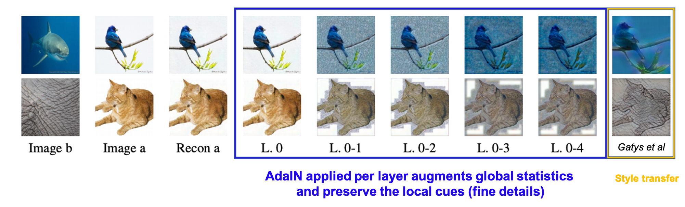

# Pytorch Implementation of [Permuted AdaIN: Reducing the Bias Towards Global Statistics in Image Classification](https://arxiv.org/abs/2010.05785) [CVPR 2021]

This repository contains the implementation of the experiments in the paper in pytorch: Image Classification (ImageNet, Cifar100), Robustness towards Corruption (ImageNet-C, Cifar100-C), and Domain Adaptaion (GTAV --> Cityscape).

Permuted AdaIN based on AdaIN for style transfer swaps image statistics in intermediate layers effectively removing the reliance of the model on global image statistics to improve image classification. 

## Intuition
Below we see the effect of applying AdaIN between two images for different layers of an encoder in a standard trained hourglass autoencoder. In addition, in the last column we see the effect of applying a style-transfer algorithm.


## GradCam Visualizations
GradCam visualizations and predictions for ImageNet trained ResNet50 models, with and without pAdaIN. Ground truth labels and model predictions appear on the bottom of each image respectively. 

In (a) and (b) the ground truth annotations correspond to global image information (in (a) the ostrich) although the image contains information corresponding to an additional ImageNet class (in (a) the fence) in the foreground. In this case, the vanilla model is correct as it relies on global image statistics while the pAdaIN model predicts the alternative class as it relies less on such information. The opposite case is depicted in (d) where pAdaIN is correct due to it's focus on local cues. However, in this case both labels can be correct.

In contrast, (c) depicts an image of shark on land. The pAdaIN model relies less on global context (such as the shark being at sea) and so predicts a shark (which correspondsto the GT annotation). The vanilla model predicts a pillow.

<p align="center">
   
</p> 

## Integrating into any standard architecture
Sample code for the class can be found in [permutedAdaIN.py](https://github.com/onuriel/PermutedAdaIN/blob/main/permutedAdaIN.py)

```
# in the init of a pytorch module for training (no learnable weights, and isn't applied during inference so can load with or without)
    self.perumte_adain = PermuteAdaptiveInstanceNorm2d(p=0.01)


# in the forward
    out = self.conv(out)
    out = self.perumte_adain(out)
    out = self.bn(out)
```

## Experiments

Experimental code was taken from multiple repositories - thus this repository only provides minor adjustments to the original repositories.
Please refer to the original repositories for setup and installation information.

#### ImageNet
   - Code is based on official pytorch ImageNet training script: https://github.com/pytorch/examples/tree/master/imagenet
   - Experiments were run with 4 GeForce RTX 2080 Ti GPUs
   - See [classification/training_script.sh](https://github.com/onuriel/PermutedAdaIN/blob/main/classification/training_scripts.sh) for an example of how to run a training experiment.
   
#### CIFAR100
 - CIFAR100 code is based on git https://github.com/weiaicunzai/pytorch-cifar100
 - See [classification/training_script.sh](https://github.com/onuriel/PermutedAdaIN/blob/main/classification/training_scripts.sh) for an example of how to run a training experiment.

#### Unsupervised Domain Adaption
 - Code based on official FADA implementation : https://github.com/JDAI-CV/FADA
 - An examples of running the three stage experiment sequentially is given in [FADA/train_with_sd.sh](https://github.com/onuriel/PermutedAdaIN/blob/main/FADA/train_with_sd.sh)

#### Robustness towards Corruption
 - Code based on https://github.com/google-research/augmix
 - Example of running the experiment is given in [corruption/training_scripts.sh](https://github.com/onuriel/PermutedAdaIN/blob/main/corruption/training_scripts.sh)
 
## Credit
If you find this work useful please consider citing it:
```
@article{nuriel2020padain,
  title={Permuted AdaIN: Reducing the Bias Towards Global Statistics in Image Classification},
  author={Nuriel, Oren and Benaim, Sagie and Wolf, Lior},
  journal={arXiv preprint arXiv:2010.05785},
  year={2020}
}
```
